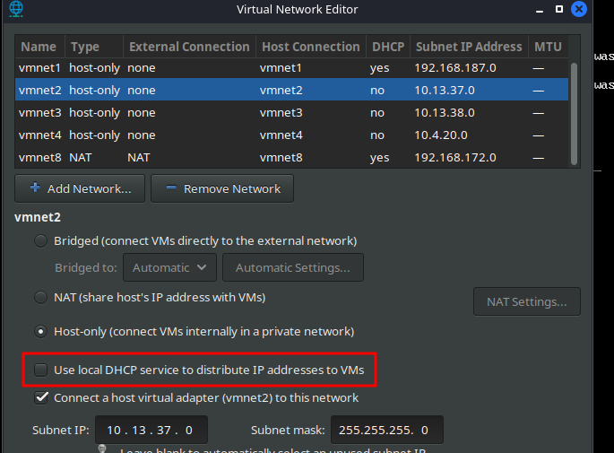
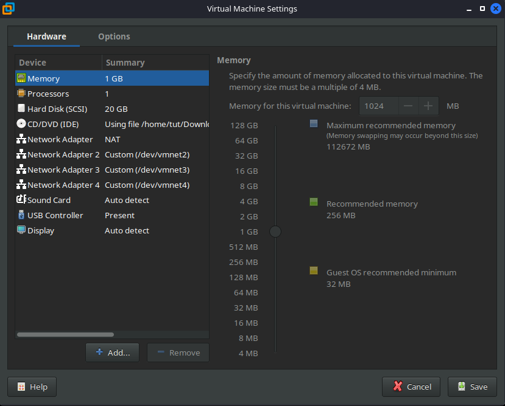
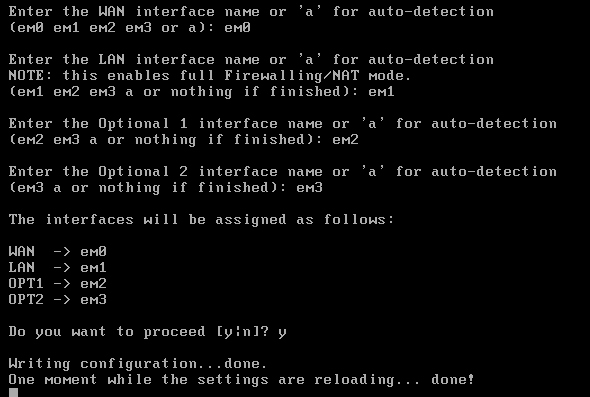
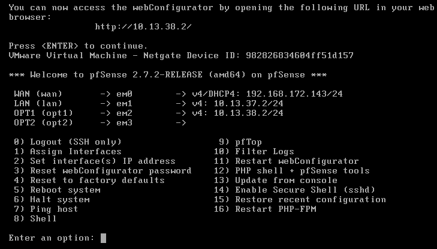
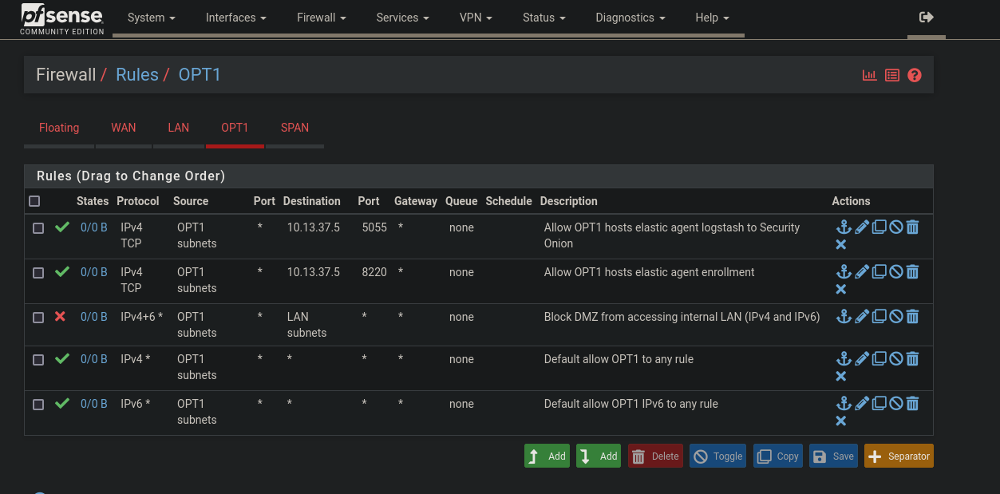
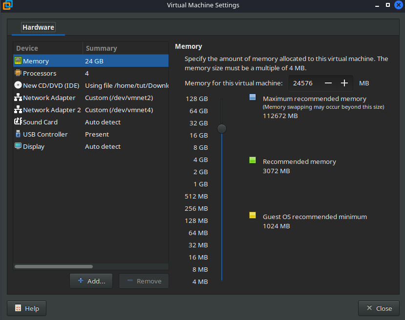
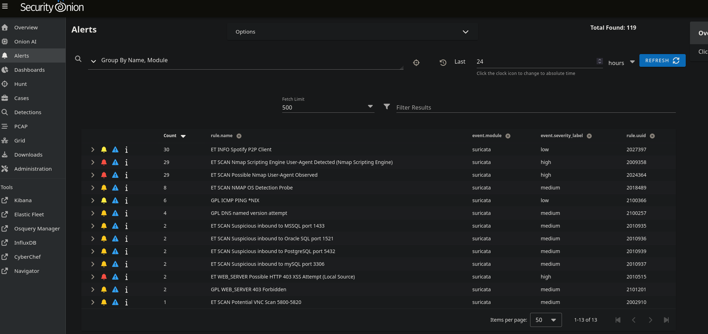
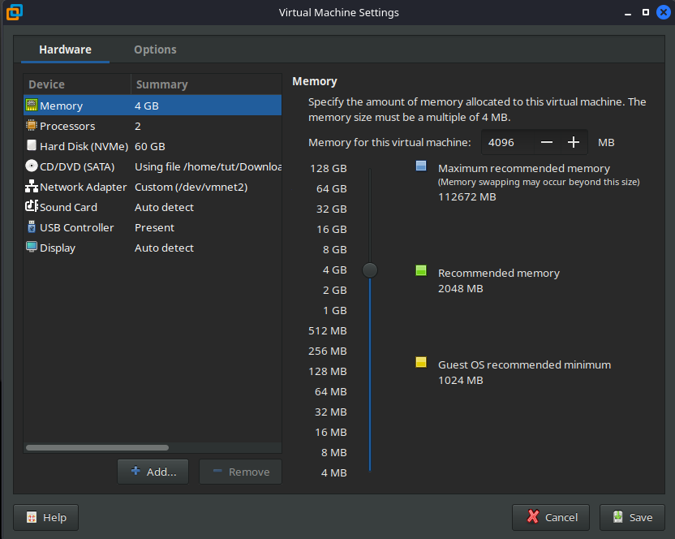

# Initial Setup Documentation
This page will go over the initial setup of the lab environment. This will include provisioning the VMs, configuring the networks, and installing the OSes.
Manual provisioning is not ideal, but it is the easiest way to get started and build towards automation later.

This guide is built-out from a Debian-based Linux machine. However, the steps should be similar for Windows host machines as well.

## Initial Startup
Get the VM images here:
- Windows Server 2025: https://www.microsoft.com/en-us/evalcenter/download-windows-server-2025
- Windows 11: https://www.microsoft.com/en-us/evalcenter/download-windows-11-enterprise
- Ubuntu: https://ubuntu.com/download/server
- Security Onion 2: https://github.com/Security-Onion-Solutions/securityonion/blob/2.4/main/DOWNLOAD_AND_VERIFY_ISO.md
- pfSense: This is mildly annoying, but they added a new way to download pfSense. I just used the archived 2.7.2 version for now, which you can grab from this mirror: https://atxfiles.netgate.com/mirror/downloads/pfSense-CE-2.7.2-RELEASE-amd64.iso.gz
- (Optional) Attack Box Kali: https://www.kali.org/get-kali/#kali-platforms
- (Optional) Attack Box Parrot: https://parrotsec.org/download/

With the bare ISOs, we can now work on provisioning and how we want to tackle that. Provision order would probably go `pfSense` -> `Security Onion` -> Any other machines.

## VMWare Setup
Before even making the images, provision the virtual networks we are going to use. We should just need to have 3 added adapters, which can be of the host-only. We should be able to use the PFSense as a WAN enabler to forward internet where we want it to go. So I have set up vmnet 2, 3, and 4 in this example to be my networks. Also, be sure to uncheck DHCP for these adapters as pfSense will cover that.



>Technically we are using 4 network adapters, 1 NAT for the pfsense WAN (this can be whatever NAT interface that automatically exists), and 3 host-only, 2 for actual usage (DMZ and internal) and 1 for SPAN TAP

Make sure to reload vmware after this to populate them correctly:
```bash
sudo systemctl restart vmware
```

### (Optional) Windows Only: Disable Side Channel Mitigations
If your host machine is Windows, for every virtual machine created you can check an option called `disable side channel mitigations for Hyper-V enabled hosts`. The setting is under `options` -> `advanced`. This will help your performance out a bit. (Maybe automate this somehow as well for Windows Machines later on)

### Linux Only: Enable Promiscuous Mode
If you are using Linux as I am for your host hypervisor, then you need to do additional steps to allow 2 of the virtual net adapters to use promiscuous mode for mirroring traffic. There is a temporary way that will be reset every time you boot, and a permanent fix.

#### Quick Fix (Temporary)
Run these commands to allow your user to enable promiscuous mode on the vmnet adapters:
```bash
# Add your current user to group access to the vmnet adapters and set rights.
sudo chgrp $(whoami) /dev/vmnet*
sudo chmod g+rw /dev/vmnet*

# Restart vmware
sudo systemctl restart vmware
```

This should now allow you to set the vmnet adapters to promiscuous mode. This configuration will NOT save, and you would need to do this on every boot you use this lab.

#### Permanent Fix
Make the permission changes permanent by modifying the VMware startup script:
```bash
# Create a group or VMware users (if you haven't already)
sudo groupadd vmware-promisc
# Add your current user to it
sudo usermod -aG vmware-promisc $USER
```

The next steps depend on whether VMware is running with `/etc/init.d/vmware` or using systemd. 
```bash
# Check if using init.d
ls -la /etc/init.d/vmware

# Check if using systemd (vmware.service probably exists even if you are using init.d, but networks won't)
systemctl status vmware.service
systemctl status vmware-networks.service
```

##### init.d Fix
Edit `/etc/init.d/vmware` and modify the vmwareStartVmnet() function:
```bash
# Whatever text editor you like
sudo nano /etc/init.d/vmware
```

Find the `vmwareStartVmnet()` function and add the permission lines:
```bash
vmwareStartVmnet() {
    vmwareLoadModule $vnet
    "$BINDIR"/vmware-networks --start >> $VNETLIB_LOG 2>&1
    chgrp vmware-promisc /dev/vmnet*
    chmod g+rw /dev/vmnet*
}
```

Then restart VMware:
```bash
sudo /etc/init.d/vmware restart
# OR
sudo systemctl restart vmware.service
# May need this one as well:
sudo systemctl daemon-reload
```

Then log out and log back in to update your group membership.

##### systemd Fix
**NOTE**: I have not tested this as my system uses `init.d`, but hopefully this works fine for those that have the `vmware-networks.service`.

First, create a script to set permissions:
```bash
sudo nano /usr/local/bin/vmware-set-promiscuous
```

Add this content:
```bash
#!/bin/bash
chgrp vmware-promisc /dev/vmnet*
chmod g+rw /dev/vmnet*
```

Make it executable:
```bash
sudo chmod +x /usr/local/bin/vmware-set-promiscuous
```

Find and edit the systemd service file:
```bash
sudo nano /etc/systemd/system/vmware-networks.service
# OR
sudo systemctl edit --full vmware-networks.service
```

Add this line in the \[Service\] section:
```bash
ExecStartPre=/usr/local/bin/vmware-set-promiscuous
```

Then reload systemd and restart:
```bash
sudo systemctl daemon-reload
sudo systemctl restart vmware-networks.service
```

Then log out and log back in to update your group membership.

## pfSense Setup
Before spinning up pfSense, give it 1 GB of RAM, and 1 CPU is fine. Give it 4 network adapters in this order `NAT` which will be for WAN, the corporate internal host-only network (`10.13.37.0/24`), the DMZ host-only network (`10.13.38.0/24`), and finally the SPAN host-only network (`10.4.20.0/24`).

Should look something like this:



Another thing to do before booting up is enable interface promiscuous mode for both the corporate internal host-only, and the DMZ interfaces. By default, VMWare does not allow this, and when you try to set up SPAN for traffic mirroring, you will get an error if you don't do this:
```
The virtual machine's operating system has attempted to enable promiscuous mode on adapter 'Ethernet1'. This is not allowed for security reasons.
Please go to the Web page "http://vmware.com/info?id=161" for help enabling promiscuous mode in the virtual machine
```

There is no GUI option for this, and you need to edit your `vmx` file directly. Ensure that `ethernet1` and `ethernet2` are your corporate internal and DMZ networks. It may be different for you if you did not add your adapters in the same order.
```bash
# Whatever text editor you like (also the name of the file depends on what you named your VM)
nano vmware/pfSense/pfSense.vmx

# Add these lines
ethernet1.noPromisc = "FALSE"
ethernet2.noPromisc = "FALSE"
```

### Initial Setup
Boot up the VM and go with all default things in the GUI for now for initial installation, once rebooted, set up the management interfaces for the DMZ and internal network. You can do this as follows:
1. First up we will assign all the interfaces, so go ahead and select option `1) Assign Interfaces`.
	1. It will ask if you want to set up VLANs, enter `n` as we can do that later in the web interface if required.
	2. Enter the interfaces in the order as you assigned, `em0` will be WAN, `em1` will be LAN (internal), Optional 1 will be `em2` the DMZ, and Optional 2 will be the SPAN `em3`. Select `y` when it looks to be assigned correctly.
	3. Now we have all of our interfaces turned on.
        
    

2. Next we will set up interfaces. First set up the LAN (corporate network `10.13.37.0/24`) by selecting the option `2`.
	1. It will ask you for which interface, select LAN which will be `em1`.
	2. Answer `n` for `Configure IPv4 address LAN interface via DHCP`.
	3. Input `10.13.37.2` for the IPv4 address.
	4. Enter `24` for the subnet bit count.
	5. Just press ENTER for none for the upstream gateway address since this is LAN.
	6. Enter `n` for configuring IPv6 via DHCP6.
	7. Go with none for the LAN IPv6 address.
	8. Enter `y` for enabling the DHCP server on LAN.
	9. Enter `10.13.37.11` for the start address of the DHCP address range. (Allows several early addresses for static mappings)
	10. Enter `10.13.37.245` for the end address of the DHCP address range. (Allows a few end addresses for static mappings)
	11. For now, enter `y` when asked to revert to HTTP as the webConfigurator protocol.
	12. This finalizes the process, and you should see our new address reflected for LAN when back at the main pfSense menu.
3. Let's quickly configure the DMZ network, which is going to be the exact same steps as the LAN one, but using the `10.13.38.0/24` address and specifying OPT1 (`em2` DMZ network) to configure. I won't go over all steps, but the IP for pfSense will be `10.13.38.2`, and the DHCP client range is `10.13.38.11` -> `10.13.38.245` same as before basically.
4. Before continuing your setup should look something like this:
    
    

5. Now we have pfSense mostly set up, we can run through the admin GUI thing. I need to figure out how to automate all of this in the future haha.
	1. You can use your host machine for this part, navigate to the pfSense web address on any of your networks (NAT, or host-only). I will use the `10.13.37.2` for this.
	2. Login to pfSense using the default credentials `admin:pfsense`. Click next on the setup and let's get started.
	3. On step 2 of 9 we can configure the following:
		1. Hostname: `pfsense` for now, but that should be configurable for automation. 
		2. Domain: `hexivra.local` in my environment, but that should be configurable as well and can be whatever you want.
		3. Primary DNS Server: `10.13.37.2` or whichever is the IP of itself on the corporate internal network.
		4. Secondary DNS Server: `8.8.8.8` for Google as fallback.
		5. Leave everything else to the default options, override DNS can be left checked.
	4. Step 3 we can leave default or specify a timezone and time-server host to utilize for NTP. I set my timezone to US/Central
	5. Step 4 I left everything to default, BUT I unchecked/disabled `Block RFC1918 Private Networks`. This is because our WAN network DOES sit in a private address space. So if we leave this on, all traffic going to and from will be blocked on the WAN interface `em0`.
	6. Step 5 has you select your LAN IP address and subnet mask which we can leave by default as we already set this up.
	7. Step 6 has you reset the pfsense admin password. Set this to whatever you want for now.
	8. Annnnd that is it, select reload and `pfsense` has been fully configured for most things.
6. The last initial setup step is to create the SPAN bridges for mirroring traffic to Security Onion. This can be done from the Web GUI, and we can figure out how to automate this later.
	1. First we need to enable our SPAN interface, go into `Interfaces` -> `OPT2` and select the following options:
		1. Enable interface `checked`
		2. (Optional) Change the `Description` to `SPAN`. (If you change this, the interface name goes from `OPT2` -> `SPAN`)
		3. Click Save. Then click Apply Changes.
	2. Go into `Interfaces` -> `Assignments` -> `Bridges` and create 2 bridges. 
	3. BRIDGE0 (the first one) select `LAN` as the member interface and in advanced options select `SPAN` or `OPT2` if you did not rename, as the value for `Span Port`. Save the settings.
	4. BRIDGE1 select `OPT1` as the member interface and in advanced options select `SPAN` or `OPT2` if you did not rename, as the value for `Span Port`. Save the settings.
	5. With these saved we have our initial setup complete. We can provision other machines at this point or add firewall rules in advance.

### Adding Firewall Rules to OPT1/DMZ
Even though we set up the second network the exact same as LAN, pfsense blocks all traffic on new interfaces by default.
I had not realized that until now, so I will detail how to add the firewall rules to allow traffic to flow through the DMZ subnet.

The default LAN rule is allow LAN to any rule for both IPv4 and IPv6. To mirror that for default setup, we can add the firewall rules as follows:
1. Go into `Firewall` -> `Rules` -> `OPT1` and create a new rule.
2. Set the following options:
	1. Select `Pass` as the action.
	2. Select `OPT1` as the interface.
	3. Select `IPv4` for the address family.
	4. Select `Any` for the protocol.
	5. Select `OPT1 subnets` for the source.
	6. Select `Any` for the destination.
	7. Set the description to `Default allow OPT1 to any rule`.
3. Do the same thing again for IPv6, but select `IPv6` for the address family.
4. Save the rules and apply the changes.

>**NOTE**: This setup allows traffic to flow from the DMZ subnet to the LAN subnet and vice versa. If you want to treat the DMZ more like a separate subnet, this can work just as it is.

To actually make this more of an actual DMZ, we can add the following rule as well to block traffic from the DMZ subnet to the LAN subnet:
1. Go into `Firewall` -> `Rules` -> `OPT1` and create a new rule.
2. Set the following options:
    1. Select `Block` as the action.
    2. Select `OPT1` as the interface.
    3. Select `IPv4+IPv6` for the address family.
    4. Select `Any` for the protocol.
    5. Select `OPT1 subnets` for the source.
    6. Select `LAN subnets` for the destination.
    7. Set the description to `Block OPT1 from accessing LAN (IPv4 and IPv6)`.
3. Reorder this block rule so that it is before the default allowed rules.
4. Save the rules and apply the changes.

With the default allowed and blocked rules in place, the DMZ should be fully functional. LAN can access DMZ, but not vice versa.

#### Elastic Agent Firewall Rules
We need to make some PASS rules to allow DMZ hosts that we plop the Elastic Agent on to communicate with Security Onion.
These are going to be direct IP rules, unless we configure Security Onion to use hostnames, in which case we need to have DNS to LAN potentially required as well.
The port for Elastic Agent Enrollment on Security Onion is `8220` and the logstash port is `5055`.

To add the rule to allow enrollment/agent traffic to Security Onion over `8220`, go into `Firewall` -> `Rules` -> `OPT1` and create a new rule.
Set the following options:
1. Select `Pass` as the action.
2. Select `OPT1` as the interface.
3. Select `IPv4` for the address family.
4. Select `TCP` for the protocol.
5. Enter `OPT1 subnets` as the source address.
6. Select `Address or Alias` for Destination and enter the Security Onion IP address `10.13.37.5`.
7. For the destination port range, select `8220` for the **From** field, and `8220` for the **To** field.
8. Set the description to `Allow OPT1 hosts elastic agent communication to Security Onion`.
9. Click Save.
10. Reorder this new rule so that it is before all other rules (at the top). 
11. Save the rules and apply the changes.

Repeat the same steps for the logstash port `5055`. So two rules are added and put to the top, and that should allow elastic agents to work correctly in the DMZ subnet.
The rules should look something like this:



## Security Onion Setup
Following loosely off of: https://docs.securityonion.net/en/2.4/vmware.html#workstation-pro and https://docs.securityonion.net/en/2.4/hardware.html#hardware

We are going to be running Security Onion in `Standalone` mode, which requires some beefier specs. The specs for Security Onion call for the following when provisioning the VM:
- Disk Space `200GB` Minimum (store as single file)
- CPU Cores `4` Minimum
- RAM Set to `24GB` minimum. (This you can probably get away with `16GB`, but that is what they recommend)
- 2 NICs
	- First one should be your corporate internal NIC (`10.13.37.0/24`) in my case `vmnet2`
	- Second one should be your span interface for capturing traffic from pfsense (`10.4.20.0/24`) in my case `vmnet4`.



Once that is all ready to go, spin it up and let's go through the setup. I am planning on setting this up in `Airgap` mode for right now, but we will see how that goes. (There shouldn't be any internet connectivity right now anyway)

Setup steps:
1. Select an installation Security Onion default option when on the installation page.
2. Type in `yes` to destroy all data in partition. 
3. Enter your administrative username; this can be anything you want. I went with `admin`. Set a password as well.
4. Wait for the initial installation and partitioning. This will take a while, but once done hit `enter` to reboot.
5. Login using the administrative creds you created. This will start the interactive security onion setup. Select yes and choose to install.
6. Select `STANDALONE` for the kind of installation and type `agree`.
7. Choose `Airgap` for the installation mode.
8. Choose the hostname, I am leaving this default for now as `securityonion`. If you use this select `use anyway` as this is standalone not multi-node.
9. Enter a description or don't, I left this blank.
10. For the management NIC, ensure you choose the internal network NIC. This should be the first one, but you can double-check the MAC to make sure.
11. Choose `STATIC` for the IP address option and enter a static IP. I went with `10.13.37.5/24` for mine. (You do need the CIDR as well) **NOTE:** This should be an IP address **NOT** inside the DHCP range given to the `pfsense`.
12. Enter the gateway IP which is our pfsense address. In my case this is `10.13.37.2`.
13. Enter the DNS servers which will be pfsense first then google as backup: `10.13.37.2,8.8.8.8`
14. The DNS search domain should be the same as what you plopped into pfsense. For me, I choose `hexivra.local`.
15. You can keep the default docker IP range, so select `yes`.
16. Select the second NIC to be the monitor interface.
17. Enter an email address, this is for the administrative login to the web interface. Enter a new password for the account associated with that email.
18. Select `IP` for accessing the web interface. Select `yes` for allowing access to this security onion installation via the web interface. Enter an IP or range that can access the web interface, since this is a lab I am using `10.13.37.0/24` which allows any host on the internal network to access it. 
19. Review the options and then proceed. It will apply the config and finish setup, which will also take quite some time. Once that finishes, click okay.

Everything is now set for Security Onion. We can log in to the web interface by browsing to `https://10.13.37.5/`. You should see alerts starting to generate from just general activity. You can test pinging the pfsense from the security onion which generates a ping alert. Also, you can run an aggressive nmap scan from your attack host or regular host which will get tracked by suricata:


### Create Static DHCP Mapping
This can be optional, but as a best practice, we should reserve the IP address the sec onion is on in `pfsense`. Through the gui interface we can do this under `Services` -> `DHCP Server`. **NOTE**: The Static IP address must not be in the DHCP range.
1. Select the `LAN` tab
2. Scroll down to **DHCP Static Mappings for this Interface**
3. Look for a button/link that says **"Add static mapping"** or similar
4. Input the Security Onion MAC and IP Address. You can find these in `Diagnostics` -> `ARP Table`. Check `ARP Table Static Entry` and fill out anything else you want to such as `Hostname`.
5. Click **Save**

You will need to reboot Security Onion at this point most likely.

### Elastic Agent Setup
#### Security Onion Firewall Configuration
Most of this is already preconfigured for us already. We just need to edit the firewall config for elastic agent checkin to allow our subnets.
In Security Onion web interface, go to `Administration` -> `Configuration` -> `firewall` -> `hostgroups` -> `elastic_agent_endpoint` and add your CIDR subnets to the field.
Do the same thing for `fleet` in the `hostgroups` section, as the elastic agent needs enrollment port and logstash port.

My setup I used both `10.13.37.0/24` and `10.13.38.0/24` in the grid values.

#### Elastic Agent Installation
Before we can install the elastic agent, we need to make sure we have the Security Onion certificates trusted on the host we are installing it on.
This can be done by copying the Security Onion CA certificate to the host and importing it into the trusted root store. The CA file is located at `/etc/pki/ca.crt` on the Security Onion host.

Linux installation:
```bash
# Copy to trusted certificates directory
sudo cp ca.crt /usr/local/share/ca-certificates/securityonion-ca.crt

# Update CA trust store
sudo update-ca-certificates

# Verify it was installed
openssl verify -CAfile /etc/ssl/certs/ca-certificates.crt /usr/local/share/ca-certificates/securityonion-ca.crt
```

Windows installation:
```powershell
# Import to Trusted Root Certification Authorities store
Import-Certificate -FilePath "C:\path\to\ca.crt" -CertStoreLocation Cert:\LocalMachine\Root

# Verify it was installed
Get-ChildItem Cert:\LocalMachine\Root | Where-Object {$_.Subject -like "*securityonion*"}
```

>In the future, we will extract this to auto provision for client hosts.

For grabbing the agent installations, you can head to the elastic fleet page and select the `Add agent` button. You can use the default the `endpoints-initial` policy.

Typical steps for Linux and Windows look like the following:
```bash
# For Linux
curl -L -O http://10.13.37.5:8443/artifacts/beats/elastic-agent/elastic-agent-8.18.8-linux-x86_64.tar.gz 
tar xzvf elastic-agent-8.18.8-linux-x86_64.tar.gz
cd elastic-agent-8.18.8-linux-x86_64
sudo ./elastic-agent install --url=https://10.13.37.5:8220 --enrollment-token=<TOKEN>
```
```powershell
# For Windows (powershell)
$ProgressPreference = 'SilentlyContinue'
Invoke-WebRequest -Uri http://10.13.37.5:8443/artifacts/beats/elastic-agent/elastic-agent-8.18.8-windows-x86_64.zip -OutFile elastic-agent-8.18.8-windows-x86_64.zip 
Expand-Archive .\elastic-agent-8.18.8-windows-x86_64.zip -DestinationPath .
cd elastic-agent-8.18.8-windows-x86_64
.\elastic-agent.exe install --url=https://10.13.37.5:8220 --enrollment-token=<TOKEN>
```

>Quick note that the `--insecure` flag is required if you still have a self-signed certificate in use and did not import the CA certificate into the trusted root store. **NOTE**: This will not run correctly out of the box, as logstash expects the clients/agents to use mTLS. The easier path is to install the CA.


### Other Useful Info
If something is not behaving or reachable, likely the services are not completely started. You can check using the following command on the Security Onion system:
```bash
sudo so-status
```

A lot more info: https://docs.securityonion.net/en/2.4/help.html


## Windows Server 2025 Setup (Domain Controller)
### VM Specs
Running this as Server Core, so it can be kept pretty light:
- CPU: 2
- RAM: 4GB
- Disk: 60GB
- NIC: Internal Network (10.13.37.0/24 | vmnet2 in my case)



### Installation Process
1. Create VM in VMware Workstation
   - Select "Typical" configuration
   - Select "I will install the operating system later."
   - Choose Microsoft Windows Server 2025 Standard as the operating system.
   - Create a name for the VM.
   - Configure hardware as specified above.

2. Windows Installation
   - Boot from ISO
   - Select language and keyboard
   - Click "Install now"
   - Choose "Windows Server 2025 Standard" (Server Core recommended)
   - Accept license terms
   - Select "Custom: Install Windows only (advanced)"
   - Select the disk and click "Create" and then "Next"
   - Wait for installation to complete

3. **Initial Server Configuration**
   - Set Administrator password when prompted
   - Log in as Administrator
   - Server Core drops you to SConfig, which is the server configuration tool.
   - Regular PowerShell can be used to run scripts, select option `15` to drop into PowerShell.
   - Optionally run `Set-SConfig -AutoLaunch $false` to disable the SConfig on startup.

### Host Configuration
Transfer the domain controller specific scripts from the `/scripts/windows` folder to the VM and run them.
Optionally grab the DC configuration files from the `/configs/windows` folder as well to customize the options for setup.

Run the initialization script:
```powershell
# With custom config file
.\Initialize-DCHost.ps1 -ConfigFile .\dc-config.json

# Or with defaults
.\Initialize-DCHost.ps1
```

This script performs the following actions (which most are configurable):
- Sets hostname
- Configures static IP address
- Sets DNS servers (127.0.0.1 as primary)
- Disables IPv6 (optional)
- Enables Remote Desktop (optional, disabled by default since we are using Server Core)
- Installs AD-Domain-Services role
- Installs DNS, RSAT tools, GPMC
- Allows ICMP through Windows firewall (for network testing purposes)

After the script completes, reboot the VM and log back in.

### Active Directory Deployment
To deploy the domain, run the following script:
```powershell
# With custom config file
.\Deploy-ADForest.ps1 -ConfigFile .\ad-config.json

# Or with defaults
.\Deploy-ADForest.ps1
```

The script performs the following actions (which most are configurable):
- Validates prerequisites
- Displays configuration summary
- Creates new AD forest and domain
- Installs and configures DNS
- Configures DNS forwarders (8.8.8.8, 1.1.1.1 by default)
- Generates DSRM password (32 characters) if not provided
- Sets DSRM password

Deployment should complete within a few minutes. If you did not specify a DSRM password, the autogenerated one will be displayed in the output for optional saving.
The script will restart the computer 20 seconds after deployment completes.

