`VMware` Workstation Pro is a hosted hypervisor that allows users to run multiple virtual machines on a single physical machine simultaneously. It enables users to set up virtual environments to install different operating systems, test software, and interact with complex systems.

After the acquisition of `VMware` by **Broadcom**, **VMware workstation pro** is now `free` for personal use.

## Downloading 

Head over to **VMware**'s [website](https://www.vmware.com/products/desktop-hypervisor/workstation-and-fusion) . We are looking for **VMware Workstation Pro for PC**:

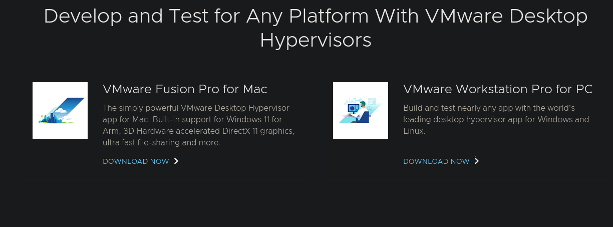

You will be redirected to the **Broadcom**'s site and will have to authenticate to gain access to the software portal.
Once authenticated (if not redirected), navigate to the https://support.broadcom.com/group/ecx/downloads endpoint.

"**NOTE:** That if you have just created a **Broadcom** account the **My Downloads** list may take time to populate. For me about 5 minutes.

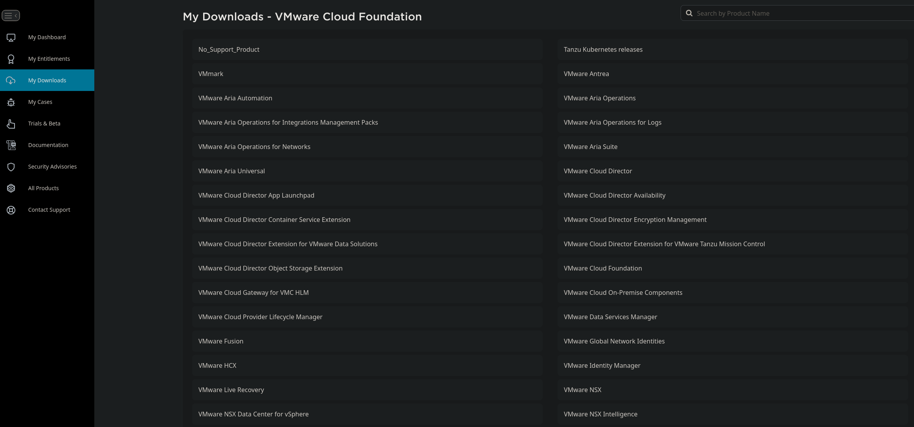

Select `VMware` Workstation Pro.

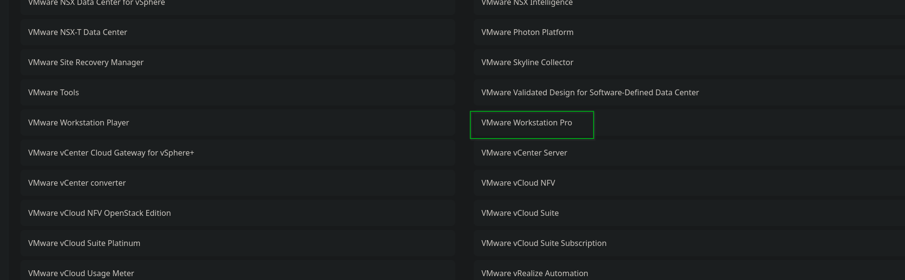

You'll need to agree to their `TOS` and select a version to download pertinent to your OS. **Make sure to select Personal Use if applicable.**

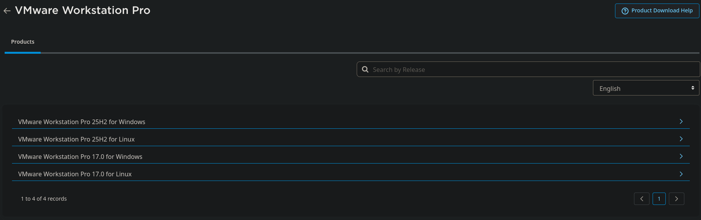

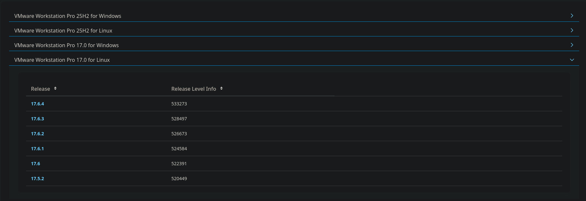

After we select a version we will be redirected once more where we can finally download the files. If your account is new there may be an additional authenticate dialog before you can initiate the download.

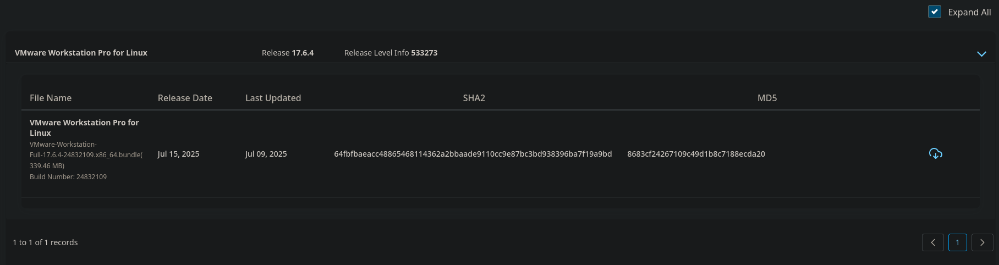

## Linux Install

For Linux we should be downloading a file with the extension `.x86_64.bundle`.

First we need to make the bundle file executable:

```sh
chmod +x VMware-Workstation-Full-<VERSION>.x86_64.bundle
```

You will need to install `VMware` Workstation**f with `sudo`:

```sh
sudo ./VMware-Workstation-Full-<VERSION>.x86_64.bundle
```

 Ensure we have requirements to compile `VMware`.

```sh
sudo apt install gcc build-essential linux-headers-generic linux-headers-$(uname -r)
```

Install

```sh
sudo vmware-modconfig --console --install-all
```

Run `VMware`

```sh
sudo vmware
```

### Patching `vmnet & vmmon` modules

If you encounter any errors during the install, your kernel version may be too new and require you to patch the network library.

A CLI tool that automates this process is available in this [Repository](https://github.com/Hyphaed/vmware-vmmon-vmnet-linux-6.17.x). This tool will compile, install, and test modules automatically. At the time of writing this supports Linux Kernel `6.16.x` & `6.17.x` and earlier.

Pull down the repository:

```bash
# Clone repository
git clone https://github.com/Hyphaed/vmware-vmmon-vmnet-linux-6.17.x.git
cd vmware-vmmon-vmnet-linux-6.17.x

# Run installation (Python wizard handles everything)
sudo ./scripts/install-vmware-modules.sh
```
#### Debian Kernel Version Detection Error Fix

At the time of writing this tool is having issues detecting kernel versions on some Debian & Debian derivative systems. There is a fix/workaround for this but it is currently in an unmerged [pull request #8](https://github.com/Hyphaed/vmware-vmmon-vmnet-linux-6.17.x/pull/8). This fixes the kernel detection via implementing Python `semver`.

Pull down the repository and checkout the pull request implementing the Debian fix:

```bash
git clone https://github.com/Hyphaed/vmware-vmmon-vmnet-linux-6.17.x.git
cd vmware-vmmon-vmnet-linux-6.17.x
git fetch origin pull/8/head:pr-8
git checkout pr-8
```

The second quick installation step found in the repository's `readme` can now be used:

```bash
# Run installation (Python wizard handles everything)
sudo ./scripts/install-vmware-modules.sh
```

### Compiling Patched Kernel Modules

On the initial start the tool will setup/install dependencies. The `CLI` will launch and prompt to start the installation:

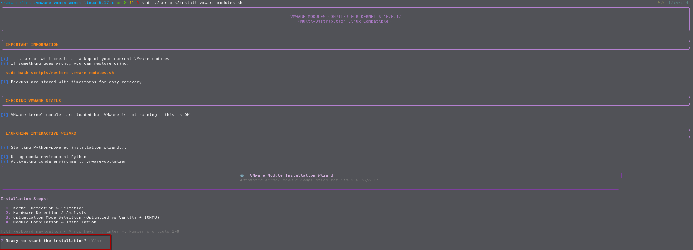

Selecting yes will detect kernel version and prompt to choose a kernel to compile modules for:

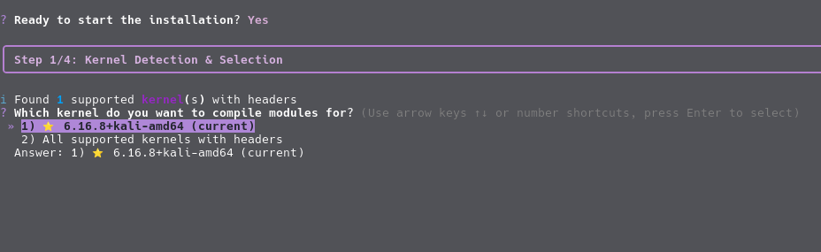

There will then be a prompt for hardware optimizations. Unless you have a legacy system option #1 should be fine;otherwise, choose option #2. 

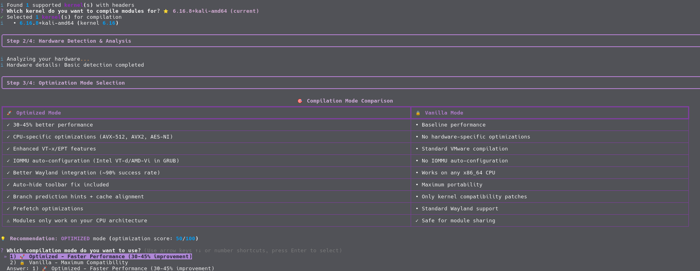

A final prompt to review the configuration is shown:

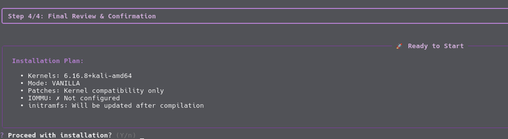

Upon success you should see "Installation & Testing Completed":

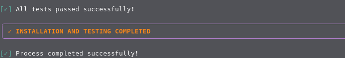

`VMware` Workstation can then be launched normally as this tool automatically loads the kernel modules:

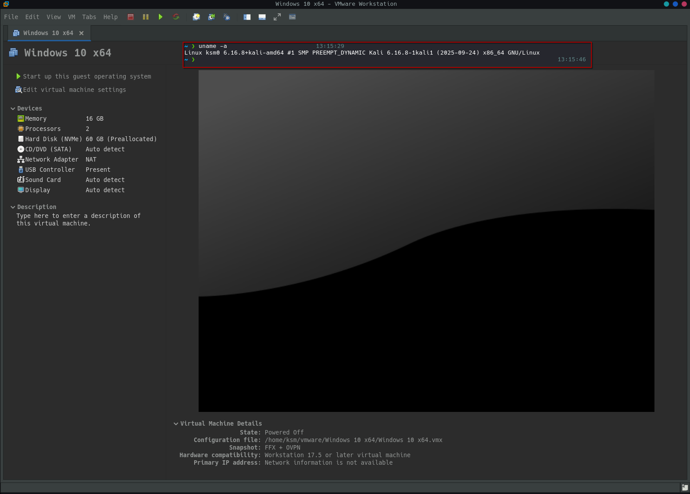


# Uninstalling `VMware` Workstation (Linux)

If for some reason you need to downgrade you can uninstall the current version with:

```sh
sudo vmware-installer -u vmware-workstation
```

Then repeat the `Linux Install` instructions with the desired version.
